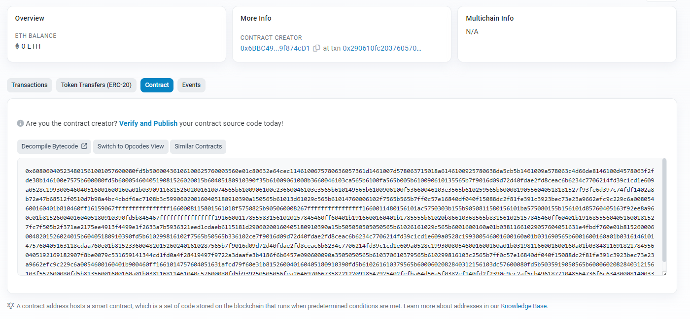
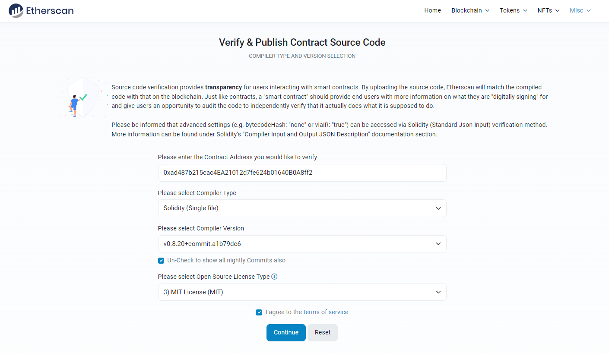
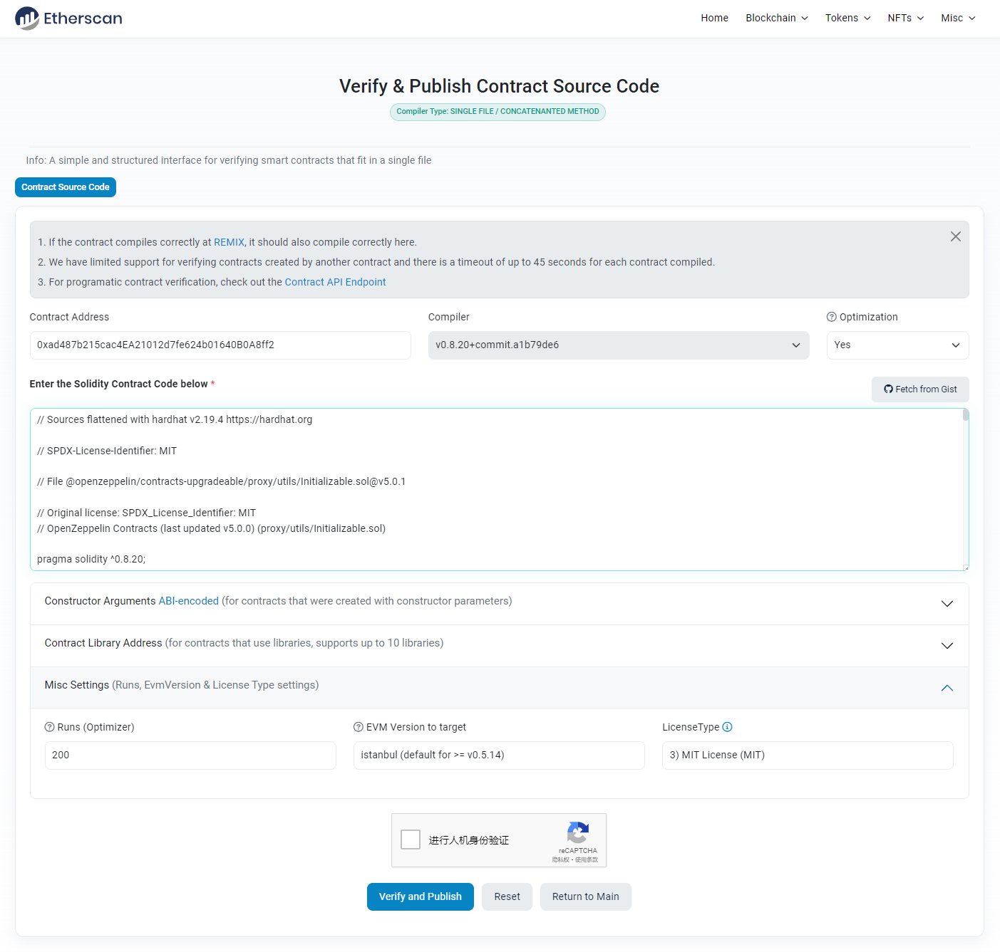
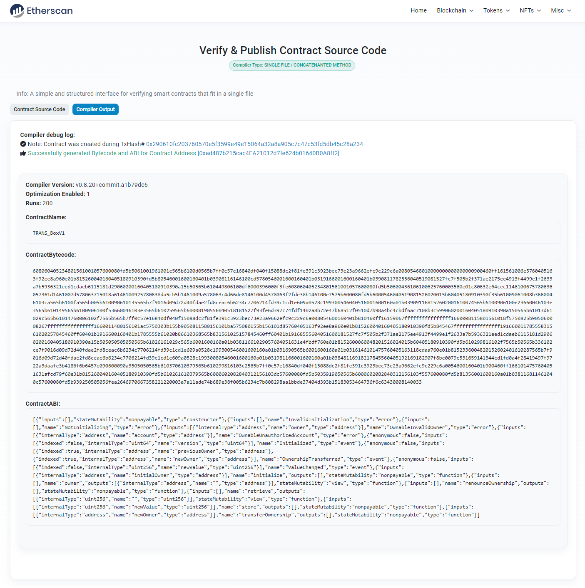
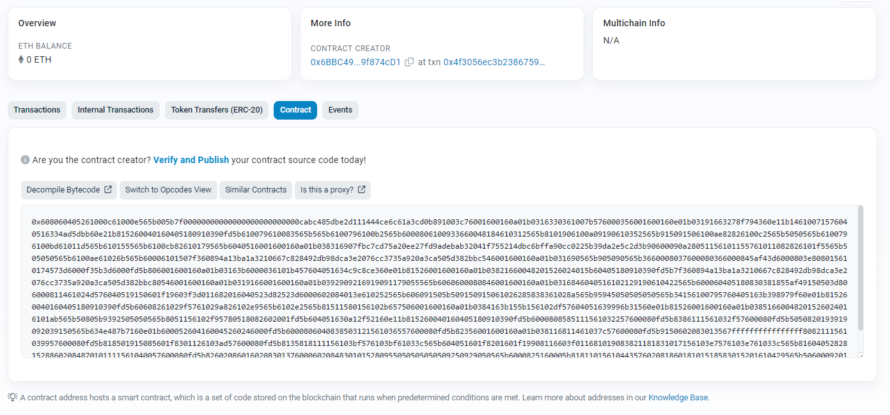
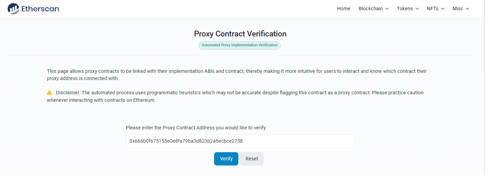
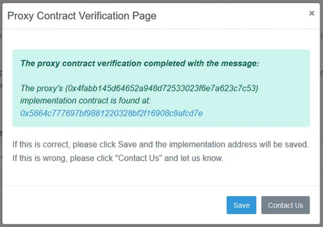
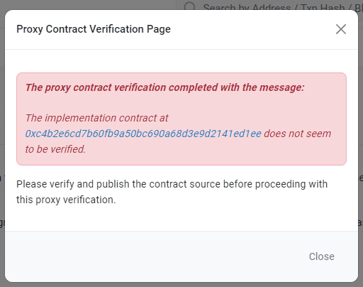
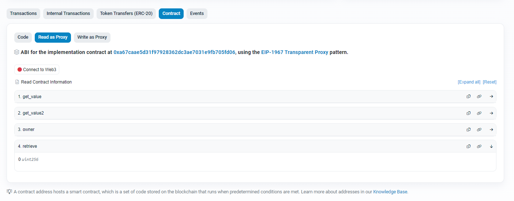
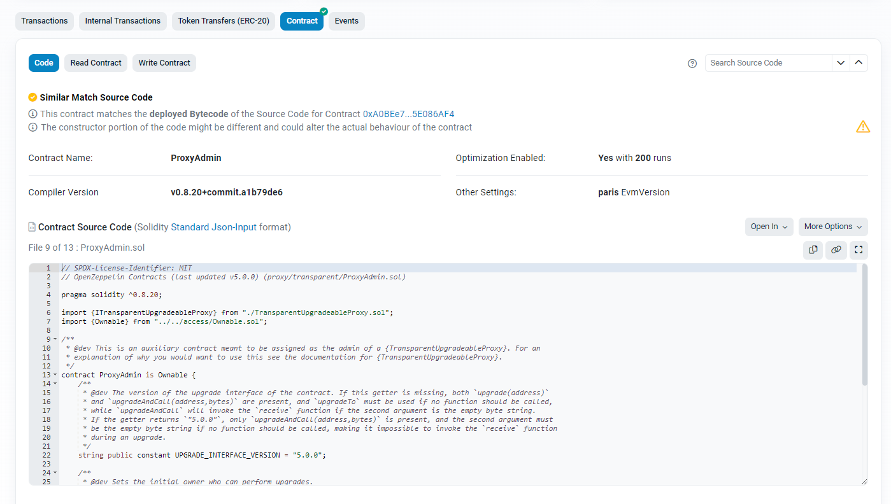

# ETHERSCAN上传和验证智能合约代码

本篇文章介绍，使用@openzeppelin/hardhat-upgrades部署可升级合约后，对合约进行验证的方法。

### 1. 验证逻辑合约（单个合约）

#### 合并智能合约文件

如果合约中引用了其他合约文件，需要使用hardhat的flatten插件将合约合并为一个文件。
 (该方法存在合并文件中文乱码问题，不影响功能)
```
npx hardhat flatten .\contracts\xxx.sol > xxx_Flattened.sol
```

#### 上传智能合约文件

在etherscan网页输入合约地址，打开如下合约界面。对于初次部署的合约，在合约界面中看不到合约代码，需要上传和验证后才能显示合约代码。点击 **Verify and Publish** 链接。



打开如下界面，依次填写基本信息：
- 合约地址：填写需要验证的智能合约地址。
- 编译类型：选择Solidity单文件。
- 编译器版本：选择实际所用的编译器版本号。
- 许可证类型：选择智能合约文件中声明的许可证类型。

勾选同意，点击下一步。



打开如下界面，上传合约代码和勾选相关设置。
- 是否优化：勾选是否优化，一般为yes。
- 智能合约代码：粘贴合并后的合约代码。
- 构造参数ABI编码：若存在构造函数参数，此处填写构造参数值的ABI编码。
- 智能合约库地址：填写使用的智能合约库地址。
- 杂项设置：设置Runs，EVM版本，许可证类型。

人机认证后，点击验证和发布。



合约验证成功后界面如下。若验证失败，会显示相关失败信息。



### 2. 设置代理合约

>注意: 设置代理合约前，需要先验证逻辑合约。

在etherscan网页输入代理合约地址，打开如下代理合约界面。点击 **is this a proxy?** 按钮。



确认代理合约地址是否正确，点击验证。



若逻辑合约已验证，弹出如下提示确认，点击save保存。



若逻辑合约未验证，弹出如下提示报错，无法继续操作。



点击save保存后，刷新代理合约界面，将看到 **Read as Proxy** 和 **Write as Proxy** 按钮，可在代理合约界面对逻辑合约进行读写操作。



### 3.管理合约

管理合约无需验证和设置，部署完成后，在网页直接可以查看合约代码。

